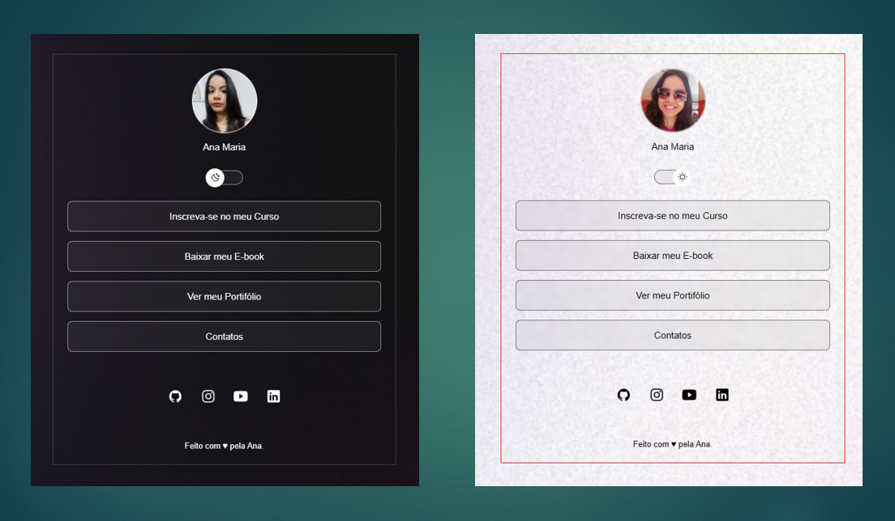

<h1 align="center"> DevLinks </h1>

<a href="https://app.rocketseat.com.br/discover/enroll?utm_source=site&utm_medium=organic&utm_campaign=lead&utm_term=discover&utm_content=botao_lpdiscover-signupplataforma">Estude esse projeto em formato de vídeo clicando aqui</a>

 

  

## 🚀 Tecnologias

Esse projeto foi desenvolvido com as seguintes tecnologias:

- HTML e CSS
- JavaScript
- Git e Github
- figma

## 💻 Projeto

O DevLinks é um agregador de links para usar como cartão de visitas online, que desenvolvi através do programa exclusivo e gratuito, promovido pela Rocketseat para ensino de tecnologias WEB.

- [Acesse o projeto finalizado, online](https://maykbrito.github.io/devlinks)

## 🔖 Layout

Você pode visualizar o layout do projeto através [DESSE LINK](https://www.figma.com/community/file/1187422022288947321). É necessário ter conta no [Figma](https://figma.com) para acessá-lo.

